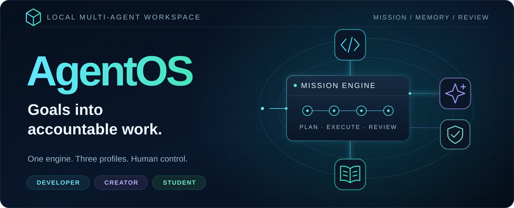
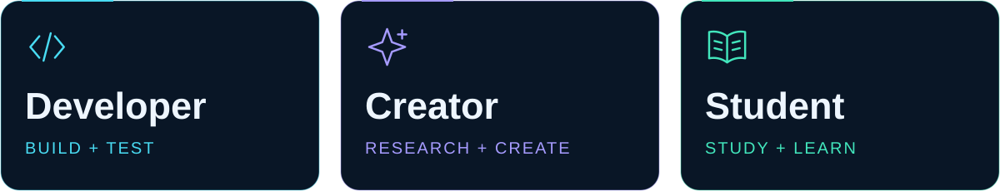
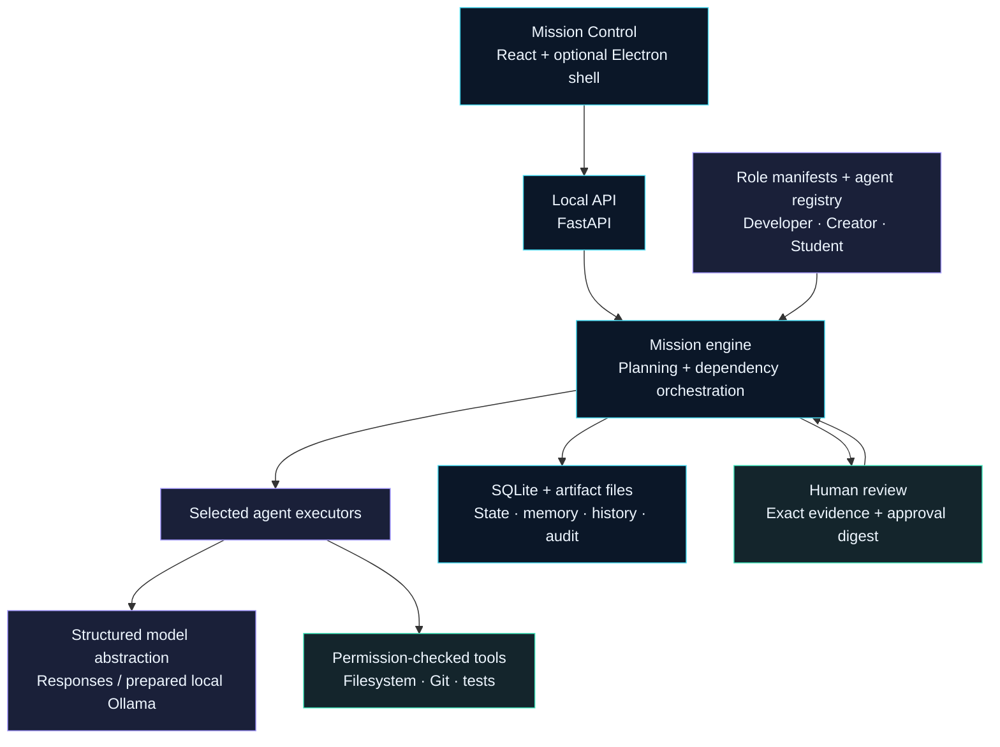
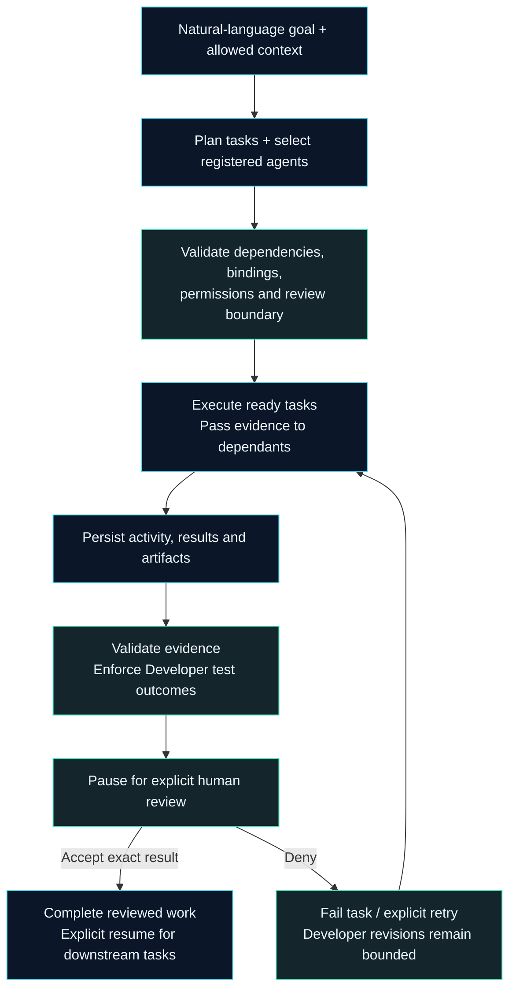

<p align="center">
  
</p>

<h1 align="center">AgentOS</h1>
<p align="center"><strong>Turn a goal into a mission. Keep every step accountable.</strong></p>
<p align="center">A local workspace for role-specific AI agents, dependency-linked tasks,<br>persistent evidence and human-reviewed results.</p>

<p align="center">
  <a href="https://github.com/amg-xai/AgentOS/actions/workflows/backend.yml"></a>
  <a href="https://github.com/amg-xai/AgentOS/actions/workflows/frontend.yml"></a>
  <a href="https://github.com/amg-xai/AgentOS/actions/workflows/desktop.yml"></a>
</p>
<p align="center"><strong>Local web + desktop shell</strong> · <strong>Three independent profiles</strong> · <strong>Explicit human review</strong></p>

> [!NOTE]
> **Development status:** continuous offline journeys are verified for all three profiles.
> Real-model execution and quality remain **unvalidated**. Generation stays disabled
> under the **₹0 budget**; the demo uses clearly labelled scripted responses.

The hero is an original concept illustration, not an application screenshot.

## Explore

[Overview](#at-a-glance) · [Capabilities](#core-capabilities) · [Architecture](#how-agentos-works) · [Screenshots](#screenshots-and-demonstrations)

[Workflows](#feature-showcases) · [Stack](#technology-stack) · [Quick start](#getting-started) · [Structure](#project-structure)

[Validation](#testing-and-validation) · [Roadmap](#roadmap) · [Security](#security-and-limitations) · [Contributing](#contributing-and-acknowledgements)


## At a glance

**One platform. Three ways to work.** Each profile loads its own registered agents
and capabilities while sharing missions, tools, memory, artifacts and approvals.



| Profile       | From goal to reviewed artifacts                                                     |
| ------------- | ----------------------------------------------------------------------------------- |
| **Developer** | Scoped issue investigation → tested diff, issue evidence and test reports           |
| **Creator**   | Supplied brief and sources → outline, script and optional graphic thumbnail         |
| **Student**   | Study material → sourced summaries, notes, quiz, answer key and optional focus plan |

Normal workflows use bounded, capability-driven planning. The offline demo uses
fixed scenarios and scripted generation; it cannot answer arbitrary requests.

## Core capabilities

| Capability                | What exists today                                                                                                                       |
| ------------------------- | --------------------------------------------------------------------------------------------------------------------------------------- |
| **Mission planning**      | Goals become validated, bounded task graphs with dependencies and input/output bindings.                                                |
| **Agent selection**       | Registered capabilities and role manifests drive assignment; unsupported plans are rejected before execution.                           |
| **Persistent context**    | Workspace notes, bounded **keyword retrieval**, mission history and artifact references survive restart. Semantic retrieval is planned. |
| **Scoped execution**      | Permission-checked filesystem, Git and configured test tools use the shared orchestrator. Developer changes stay in scratch copies.     |
| **Inspectable artifacts** | Planning evidence, source provenance, text/JSON reports, diffs and PNG outputs are stored with integrity checks.                        |
| **Human review**          | Exact staged evidence is bound to approval records. Role checks and audit events protect execution and decisions.                       |

Mission Control exposes role/agent discovery, mission creation, task dependencies,
recorded activity, filtered history, artifact downloads, memory and result review.


## How AgentOS works

On narrow screens, use GitHub's diagram expand control to inspect the labels.

### Shared architecture



The same engine serves every profile. The provider abstraction does not grant
tool permissions, authorize publishing or replace human approval.

### From request to reviewed result



Failed validation or tests cannot become accepted Developer results. A completed
content task does not mean software tests ran or claims were independently verified.

## Screenshots and demonstrations

> **Screenshot gallery pending — no application captures are currently tracked.**
> The graphics above illustrate the architecture; they do not show the actual UI.

| Capture to add            | What it should demonstrate                                              |
| ------------------------- | ----------------------------------------------------------------------- |
| Mission Control dashboard | Explicit offline-demo label, profile selector and persisted missions    |
| Developer mission review  | Agent assignments, dependency graph, tested diff and actual test report |
| Creator artifact review   | Source-linked script and optional graphic thumbnail                     |
| Student study bundle      | Evidence, summarized notes, quiz and separate answer key                |

Follow the [offline walkthrough](docs/getting-started.md#offline-demo-without-a-model)
for a reproducible demonstration with isolated history and labelled fixture output.


## Feature showcases

### Developer — investigate, patch, test, review

**Input:** an issue goal, selected project files and frozen test-command recipes.

**Processing:** planning selects investigation, local Issue Agent, patch and
testing capabilities. Developer v3 records actual baseline/patched test outcomes
in isolated copies, preserves the goal/constraints and allows at most two
patch-revision cycles.

**Output:** five bound review artifacts: baseline report, patched report, tested
diff and JSON/text issue evidence. Acceptance does **not** modify the original
checkout or publish a PR.

The offline Calculator demo uses a fixed subtraction-to-addition patch with
real Git checks and three tests. Its compatible scripted contract is not a
real-AI v3 demonstration.

[Developer scope](docs/local-workflow.md) · [Planning contracts](docs/developer-planning.md)

### Creator — source, outline, script, illustrate

**Input:** a content brief, optional supplied sources and a thumbnail request.

**Processing:** capability-driven research and outline/script work preserves
source evidence. An optional graphic-layout agent describes a layout that a
local renderer turns into a PNG; it is not AI image generation.

**Output:** reviewed script/evidence artifacts and optionally a graphic thumbnail
and rendering receipt. Exact text/image evidence is frozen for approval.
The offline demo creates a fixed outline and script, without research or images.

[Creator walkthrough and limits](docs/creator-workflow.md)

### Student — research, summarize, learn

**Input:** supplied study material or pasted sources, a goal and optional study settings.

**Processing:** sourced v2 plans select Research/Study → Summarizer → Notes → Quiz,
with an optional Focus plan. Quotes and references link findings, summaries and
questions to evidence. Saved v1 plans remain supported.

**Output:** reviewed study evidence, notes, quiz, separate answer key and optional
focus schedule. No automatic exam scoring or independent web research.
The offline demo uses fixed stacks-and-queues notes and questions.

[Student walkthrough and evidence contracts](docs/student-workflow.md)

## Technology stack

| Layer             | Repository stack                                                        |
| ----------------- | ----------------------------------------------------------------------- |
| Mission Control   | React 19 · TypeScript · Vite · CSS                                      |
| Local API         | Python 3.11+ · FastAPI · Uvicorn · Pydantic                             |
| Orchestration     | Shared Python mission/dependency services · JSON manifests              |
| State and memory  | SQLite · filesystem artifacts · bounded keyword retrieval               |
| Model interface   | HTTPX · JSON Schema · Responses adapter · optional Ollama adapter       |
| Graphic rendering | Pillow · bundled font assets                                            |
| Desktop shell     | Electron · owned loopback backend lifecycle                             |
| Verification      | pytest · Ruff · mypy · Vitest · Testing Library · Node tests · Prettier |

Dependency contracts: [backend](backend/pyproject.toml), [frontend](frontend/package.json)
and [desktop](desktop/package.json). No cloud platform, vector database or external
ticket service is required by the current core.


## Getting started

### 1. Set up locally

Requirements: **Python 3.11+**, **Node.js 22.12+** (24 recommended), **Git** and PowerShell.
The demo needs no API key, model runner or downloaded model. Dependency installation
fetches ordinary open-source packages; it does not invoke AI inference.

```powershell
git clone https://github.com/amg-xai/AgentOS.git
cd AgentOS
python -m venv .venv
.\.venv\Scripts\python.exe -m pip install -e "./backend[dev]"
npm --prefix frontend ci --no-fund --no-audit
npm --prefix frontend run build
```

Already have this checkout and its dependencies? Start from the next step.

### 2. Start the explicit offline demo

```powershell
.\.venv\Scripts\python.exe -m agentos doctor --demo
.\Start-AgentOS.ps1 -Demo
```

Open **[Mission Control](http://127.0.0.1:8000/app/)**. Select a workflow,
click **+ New mission**, create its fixed scenario and choose **Run mission**.
Inspect tasks/artifacts, then explicitly accept or deny the result. Stop with **Ctrl+C**.

**Offline demo means scripted generation with zero model calls.** Developer tools
still perform real scratch patch checks and tests. Ignored `.agentos/demo/` data
is separate from normal history; original source files remain unchanged.

The launcher prefers an existing `.venv-runtime` over `.venv`; use the selected
interpreter for diagnostics too. Do not combine `-Demo` with `-SetupSample`.
On another OS, from an installed environment: `python -m agentos serve --demo`.

### 3. Keep optional model setup separate

Generation remains disabled under the ₹0 budget. The prepared Ollama path uses
literal loopback endpoints, cloud-disabled verification, installed-model checks
and retained request ledgers. No runner/model has been installed or successfully
tested by that preparation. Normal mode never downloads or substitutes fixtures.

Read [local inference preparation](docs/local-inference.md) before considering
setup. Downloads and real inference need separate explicit approval. Do not enable
a cloud free tier or use a billing account as a shortcut.

See the [full setup guide](docs/getting-started.md), [provider reference](docs/providers.md)
and [desktop guide](docs/desktop.md) for diagnostics, alternate projects and the
optional shell. Normal startup without a generator still exposes discovery and saved data.

## Project structure

```text
AgentOS/
├── backend/               # Domain, services, adapters, API and tests
├── frontend/              # React Mission Control + continuous acceptance
├── desktop/               # Electron shell and lifecycle/security tests
├── packages/              # Independent Developer, Creator, Student manifests
├── samples/calculator/    # Fixed offline Developer scenario
├── docs/                  # Contracts, guides, validation and visual assets
├── Start-AgentOS.ps1      # Windows web launcher
├── Start-AgentOSDesktop.ps1
├── AGENTS.md              # Development and review rules
├── ARCHITECTURE.md         # Current implementation boundaries
└── PLAN.md                # Original, authoritative roadmap
```

Databases, scratch copies and local configuration live in ignored locations.
The [API/runtime reference](docs/api-guide.md) preserves configuration overrides,
versioned mutations, approvals, artifact endpoints and lifecycle examples.

## Testing and validation

The badges link to actual GitHub Actions workflows. Backend/desktop checks and
continuous UI/backend acceptance run on Linux and Windows.

| Automated coverage      | What it verifies                                                                                                                                    |
| ----------------------- | --------------------------------------------------------------------------------------------------------------------------------------------------- |
| Core/provider contracts | Plans, dependencies, permissions, provenance, artifacts, request ledgers and local-provider failures                                                |
| Continuous Developer v3 | Actual baseline/patched tests, five review artifacts, failed-test rejection, revisions, approval, restart persistence and original-source integrity |
| Continuous Creator      | Sourced script and PNG review, invalid evidence/layout rejection and persistence                                                                    |
| Continuous Student      | Sourced quiz/focus journeys, provenance rejection, review and persistence                                                                           |
| Desktop lifecycle       | Backend ownership, launch identity, navigation/download safeguards and shutdown                                                                     |

[Recorded local validation](docs/validation.md#zero-budget-local-inference-preparation)
reports **734 backend passes + 3 existing Windows skips**, **119 frontend tests**,
**10 continuous journeys** and **26 desktop tests**, with build/type/lint/format
checks passing. These are dated evidence, not live counters.

**Model outputs in automated acceptance use injected transport.** Real tools,
tests and persistence are exercised; real-model quality is not validated.
Native visual/accessibility acceptance and standalone desktop packaging remain incomplete.

<details>
<summary><strong>Run the checks locally</strong></summary>

```powershell
.\.venv\Scripts\python.exe -m pytest backend/tests
.\.venv\Scripts\python.exe -m ruff check backend
.\.venv\Scripts\python.exe -m ruff format --check backend
.\.venv\Scripts\python.exe -m mypy --config-file backend/pyproject.toml backend/src
npm --prefix frontend test
npm --prefix frontend run build
npm --prefix frontend run format:check
$env:AGENTOS_TEST_PYTHON = (Resolve-Path .\.venv\Scripts\python.exe).Path
npm --prefix frontend run test:integration
npm --prefix desktop test
npm --prefix desktop run check
npm --prefix desktop run format:check
```

Use `.venv-runtime` consistently if that is your installed environment. Desktop
checks need their existing Node dependencies; see its guide before installing
a native runtime. None of these commands authorizes model calls.

</details>

## Roadmap

The original **[PLAN.md](PLAN.md)** remains authoritative. This summary does not
replace it or declare the full MVP complete.

| Status                             | Original roadmap requirement                                                                              |
| ---------------------------------- | --------------------------------------------------------------------------------------------------------- |
| **Implemented**                    | Registries, mission/task engine, orchestration, scoped tools, approvals, audit and persistent artifacts   |
| **Implemented**                    | Bounded Developer, Creator and Student workflows with continuous offline acceptance                       |
| **Implemented**                    | Mission Control, workspace notes, keyword retrieval, history and checkout-based Electron shell            |
| **In progress — preparation only** | First complete **real-AI** workflow: local adapter prepared; runner/model and mission quality unvalidated |
| **Planned**                        | Phase 6 semantic retrieval and broader layered context                                                    |
| **Planned / optional**             | Broader role capabilities and GitHub/GitLab, Slack/Jira, browser and other tool adapters                  |
| **Pending validation / packaging** | Native desktop visual acceptance and standalone distribution                                              |

External tickets, PR publication and deployment are not prerequisites for the
local showcase. The core does not depend on Slack/Jira; deployment is never automatic.

## Security and limitations

- **Trusted local execution:** bind to `127.0.0.1`. Remote authentication and multi-user hosting are not implemented.
- **Scoped permissions:** server-configured Viewer/Operator/Admin access and agent tool permissions are enforced; clients cannot choose their role.
- **Exact review evidence:** stale versions, mismatched digests and modified artifacts are rejected. Result approval grants no publication or deployment permission.
- **Developer isolation:** frozen recipes, scratch changes and explicit test outcomes protect original files. Passing tests do not prove complete correctness.
- **Bounded dispatch:** generation defaults off; production calls require a matching policy and durable ledger. No automatic retries or fixture fallback.
- **Content limits:** evidence provenance is not independent fact-checking. Graphics are locally rendered layouts; Student does not grade exams or browse independently.
- **₹0 policy:** no paid APIs, billing changes or unapproved model downloads. Keep local credentials ignored and never publish sensitive evidence.

[Runtime and recovery](docs/workflows.md) · [Tool boundaries](docs/integrations.md) · [Dispatch safeguards](docs/live-acceptance-limits.md)

## Contributing and acknowledgements

Read [AGENTS.md](AGENTS.md), [ARCHITECTURE.md](ARCHITECTURE.md) and the original
[PLAN.md](PLAN.md). Propose major changes, add meaningful checks and keep commits
small and reviewable. Review notes stay in ignored `docs/reviews/`; essential
product documentation belongs in Git.

**License:** no project-wide license file is currently included. No open-source
license grant is implied; bundled font notices remain with their assets.

Visual direction inspired by [TransitOps](https://github.com/amg-xai/transitops-hackathon).
AgentOS illustrations are original local SVG artwork; no TransitOps images were copied.
See [asset provenance and screenshot guidance](docs/images/README.md).

<p align="center"><strong>Build the platform once. Keep profiles modular. Keep humans in control.</strong></p>
